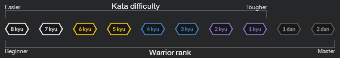

<h1>Codewars katas completed by davcd</h1>

 <a href="https://www.codewars.com">Codewars</a> is an online educational coding platform where users aka "<a href="https://www.codewars.com/users/leaderboard"><i>warriors</i></a>" solve code challenges aka "<a href="https://github.com/codewars/codewars.com/wiki/About-Codewars#kata"><i>katas</i></a>" to improve their coding skills. Each kata is set to a kyu rank, based on its subject area and difficulty. Every new warrior is ranked as 8 kyu (Beginner) and can rank up by completing katas.

<blockquote>For more detailed information please visit <a href="https://github.com/Codewars/codewars.com/wiki">codewars wiki</a></blockquote><i>Following <a href="https://github.com/codewars/codewars.com/wiki/Community-Code-of-Conduct">codewars code of conduct</a>, in this public repository you will not find any solution. Please <a href="mailto:hello@davcd.com">contact me</a> if you are interested in checking my code.</i>
<h2>Overview</h2>
<h3>Overall statistics</h3>
<table>
  <tbody>
    <tr>
      <td>Rank</td>
      <td>3 kyu</td>
    </tr>
    <tr> 
      <td>Score</td>
      <td>2141</td>
    </tr>
    <tr> 
      <td>Honor</td>
      <td>1117</td>
    </tr>
    <tr> 
      <td>Completed katas</td>
      <td>53</td>
    </tr>
    <tr> 
      <td>Authored katas</td>
      <td>-</td>
    </tr>
  </tbody>
</table>
<h3>Language summary</h3>
<table>
  <thead>
    <tr>
      <th rowspan="3">Language</th>
      <th rowspan="3">Rank</th>
      <th colspan="10">Completed katas</th>
    </tr>
    <tr> 
      <th>Beta</th>
      <th colspan="2"> Beginner</th>
      <th colspan="2"> Novice</th>
      <th colspan="2"> Competent</th>
      <th colspan="2"> Proficient</th>
      <th rowspan="2"> Total</th>
    </tr>
    <tr> 
      <th>Any</th>
      <th>8 kyu</th>
      <th>7 kyu</th>
      <th>6 kyu</th>
      <th>5 kyu</th>
      <th>4 kyu</th>
      <th>3 kyu</th>
      <th>2 kyu</th>
      <th>1 kyu</th>
    </tr>
  </thead>
  <tbody></tbody>
  <tr>
    <td>javascript</td>
    <td>3 kyu</td>
    <td>-</td>
    <td>7</td>
    <td>5</td>
    <td>4</td>
    <td>5</td>
    <td>5</td>
    <td>4</td>
    <td>2</td>
    <td>-</td>
    <td>32</td>
  </tr>
  <tr>
    <td>php</td>
    <td>5 kyu</td>
    <td>-</td>
    <td>3</td>
    <td>5</td>
    <td>6</td>
    <td>-</td>
    <td>4</td>
    <td>-</td>
    <td>-</td>
    <td>-</td>
    <td>18</td>
  </tr>
  <tr>
    <td>java</td>
    <td>8 kyu</td>
    <td>-</td>
    <td>1</td>
    <td>1</td>
    <td>-</td>
    <td>-</td>
    <td>-</td>
    <td>-</td>
    <td>-</td>
    <td>-</td>
    <td>2</td>
  </tr>
  <tr>
    <td>sql</td>
    <td>8 kyu</td>
    <td>-</td>
    <td>1</td>
    <td>-</td>
    <td>-</td>
    <td>-</td>
    <td>-</td>
    <td>-</td>
    <td>-</td>
    <td>-</td>
    <td>1</td>
  </tr>
</table>
<h3>Topic summary</h3>
<blockquote>10 most popular</blockquote>
<table>
  <thead>
    <tr>
      <th>Topic</th>
      <th>Completed katas</th>
    </tr>
  </thead>
  <tbody></tbody>
  <tr>
    <td>Fundamentals</td>
    <td>35</td>
  </tr>
  <tr>
    <td>Data Types</td>
    <td>31</td>
  </tr>
  <tr>
    <td>Algorithms</td>
    <td>30</td>
  </tr>
  <tr>
    <td>Logic</td>
    <td>23</td>
  </tr>
  <tr>
    <td>Strings</td>
    <td>19</td>
  </tr>
  <tr>
    <td>Numbers</td>
    <td>15</td>
  </tr>
  <tr>
    <td>Arrays</td>
    <td>14</td>
  </tr>
  <tr>
    <td>Basic Language Features</td>
    <td>12</td>
  </tr>
  <tr>
    <td>Mathematics</td>
    <td>11</td>
  </tr>
  <tr>
    <td>Control Flow</td>
    <td>7</td>
  </tr>
</table>
<h2>Solved katas by language</h2>
<h3>javascript</h3>
<table>
  <thead>
    <tr>
      <th>Difficulty</th>
      <th>Name</th>
      <th>Date</th>
    </tr>
  </thead>
  <tbody></tbody>
  <tr>
    <td>2 kyu</td>
    <td><a href="./kata/evaluate-mathematical-expression">Evaluate mathematical expression</a></td>
    <td>2020-03-26</td>
  </tr>
  <tr>
    <td>2 kyu</td>
    <td><a href="./kata/multi-line-task-plus-plus-hello-world">Multi Line Task++: Hello World</a></td>
    <td>2020-03-25</td>
  </tr>
  <tr>
    <td>3 kyu</td>
    <td><a href="./kata/the-lift">The Lift</a></td>
    <td>2020-04-08</td>
  </tr>
  <tr>
    <td>3 kyu</td>
    <td><a href="./kata/make-a-spiral">Make a spiral</a></td>
    <td>2020-04-08</td>
  </tr>
  <tr>
    <td>3 kyu</td>
    <td><a href="./kata/calculator">Calculator</a></td>
    <td>2020-03-25</td>
  </tr>
  <tr>
    <td>3 kyu</td>
    <td><a href="./kata/alphabetic-anagrams">Alphabetic Anagrams</a></td>
    <td>2020-03-21</td>
  </tr>
  <tr>
    <td>4 kyu</td>
    <td><a href="./kata/spaghetti-code-number-2-hard">Spaghetti Code - #2 Hard</a></td>
    <td>2020-04-05</td>
  </tr>
  <tr>
    <td>4 kyu</td>
    <td><a href="./kata/longest-common-subsequence-performance-version">Longest Common Subsequence (Performance version)</a></td>
    <td>2020-03-24</td>
  </tr>
  <tr>
    <td>4 kyu</td>
    <td><a href="./kata/sudoku-solution-validator">Sudoku Solution Validator</a></td>
    <td>2020-03-18</td>
  </tr>
  <tr>
    <td>4 kyu</td>
    <td><a href="./kata/human-readable-duration-format">Human readable duration format</a></td>
    <td>2020-03-18</td>
  </tr>
  <tr>
    <td>4 kyu</td>
    <td><a href="./kata/snail">Snail</a></td>
    <td>2020-03-14</td>
  </tr>
  <tr>
    <td>5 kyu</td>
    <td><a href="./kata/reverse-inside-parentheses-inside-parentheses">Reverse Inside Parentheses (Inside Parentheses)</a></td>
    <td>2020-04-05</td>
  </tr>
  <tr>
    <td>5 kyu</td>
    <td><a href="./kata/is-the-king-in-check">Is the King in check ?</a></td>
    <td>2020-03-24</td>
  </tr>
  <tr>
    <td>5 kyu</td>
    <td><a href="./kata/longest-common-subsequence">Longest Common Subsequence</a></td>
    <td>2020-03-24</td>
  </tr>
  <tr>
    <td>5 kyu</td>
    <td><a href="./kata/josephus-survivor">Josephus Survivor</a></td>
    <td>2020-03-15</td>
  </tr>
  <tr>
    <td>5 kyu</td>
    <td><a href="./kata/josephus-permutation">Josephus Permutation</a></td>
    <td>2020-03-15</td>
  </tr>
  <tr>
    <td>6 kyu</td>
    <td><a href="./kata/duplicate-encoder">Duplicate Encoder</a></td>
    <td>2020-03-23</td>
  </tr>
  <tr>
    <td>6 kyu</td>
    <td><a href="./kata/upside-down-numbers">Upside down numbers</a></td>
    <td>2020-03-17</td>
  </tr>
  <tr>
    <td>6 kyu</td>
    <td><a href="./kata/find-the-odd-int">Find the odd int</a></td>
    <td>2020-03-14</td>
  </tr>
  <tr>
    <td>6 kyu</td>
    <td><a href="./kata/array-dot-diff">Array.diff</a></td>
    <td>2020-03-14</td>
  </tr>
  <tr>
    <td>7 kyu</td>
    <td><a href="./kata/find-the-capitals">Find the Capitals</a></td>
    <td>2020-05-24</td>
  </tr>
  <tr>
    <td>7 kyu</td>
    <td><a href="./kata/coloured-triangles">Coloured Triangles</a></td>
    <td>2020-03-22</td>
  </tr>
  <tr>
    <td>7 kyu</td>
    <td><a href="./kata/friend-or-foe">Friend or Foe?</a></td>
    <td>2020-03-15</td>
  </tr>
  <tr>
    <td>7 kyu</td>
    <td><a href="./kata/no-oddities-here">No oddities here</a></td>
    <td>2020-03-13</td>
  </tr>
  <tr>
    <td>7 kyu</td>
    <td><a href="./kata/list-filtering">List Filtering</a></td>
    <td>2020-03-13</td>
  </tr>
  <tr>
    <td>8 kyu</td>
    <td><a href="./kata/get-planet-name-by-id">Get Planet Name By ID</a></td>
    <td>2020-05-24</td>
  </tr>
  <tr>
    <td>8 kyu</td>
    <td><a href="./kata/welcome">Welcome!</a></td>
    <td>2020-05-24</td>
  </tr>
  <tr>
    <td>8 kyu</td>
    <td><a href="./kata/no-loops-2-you-only-need-one">No Loops 2 - You only need one</a></td>
    <td>2020-05-24</td>
  </tr>
  <tr>
    <td>8 kyu</td>
    <td><a href="./kata/is-he-gonna-survive">Is he gonna survive?</a></td>
    <td>2020-04-10</td>
  </tr>
  <tr>
    <td>8 kyu</td>
    <td><a href="./kata/is-the-string-uppercase">Is the string uppercase?</a></td>
    <td>2020-04-05</td>
  </tr>
  <tr>
    <td>8 kyu</td>
    <td><a href="./kata/function-1-hello-world">Function 1 - hello world</a></td>
    <td>2020-03-13</td>
  </tr>
  <tr>
    <td>8 kyu</td>
    <td><a href="./kata/multiply">Multiply</a></td>
    <td>2019-11-01</td>
  </tr>
</table>
<h3>php</h3>
<table>
  <thead>
    <tr>
      <th>Difficulty</th>
      <th>Name</th>
      <th>Date</th>
    </tr>
  </thead>
  <tbody></tbody>
  <tr>
    <td>4 kyu</td>
    <td><a href="./kata/vigenere-cipher-helper">Vigenère Cipher Helper</a></td>
    <td>2020-05-05</td>
  </tr>
  <tr>
    <td>4 kyu</td>
    <td><a href="./kata/matrix-determinant">Matrix Determinant</a></td>
    <td>2020-04-24</td>
  </tr>
  <tr>
    <td>4 kyu</td>
    <td><a href="./kata/sum-of-intervals">Sum of Intervals</a></td>
    <td>2020-04-24</td>
  </tr>
  <tr>
    <td>4 kyu</td>
    <td><a href="./kata/sum-strings-as-numbers">Sum Strings as Numbers</a></td>
    <td>2020-04-24</td>
  </tr>
  <tr>
    <td>6 kyu</td>
    <td><a href="./kata/pascals-triangle">Pascal's Triangle</a></td>
    <td>2020-04-24</td>
  </tr>
  <tr>
    <td>6 kyu</td>
    <td><a href="./kata/playing-with-digits">Playing with digits</a></td>
    <td>2020-04-18</td>
  </tr>
  <tr>
    <td>6 kyu</td>
    <td><a href="./kata/create-phone-number">Create Phone Number</a></td>
    <td>2020-04-18</td>
  </tr>
  <tr>
    <td>6 kyu</td>
    <td><a href="./kata/linux-history-and-`-`-command-series-number-1-the-`-`-command">Linux history and  `!` command. Series#1  The `!!` command</a></td>
    <td>2020-04-12</td>
  </tr>
  <tr>
    <td>6 kyu</td>
    <td><a href="./kata/snap">SNAP</a></td>
    <td>2020-04-12</td>
  </tr>
  <tr>
    <td>6 kyu</td>
    <td><a href="./kata/convert-string-to-camel-case">Convert string to camel case</a></td>
    <td>2020-04-11</td>
  </tr>
  <tr>
    <td>7 kyu</td>
    <td><a href="./kata/alternate-capitalization">Alternate capitalization</a></td>
    <td>2020-04-11</td>
  </tr>
  <tr>
    <td>7 kyu</td>
    <td><a href="./kata/sum-of-minimums">Sum of Minimums!</a></td>
    <td>2020-04-11</td>
  </tr>
  <tr>
    <td>7 kyu</td>
    <td><a href="./kata/find-the-area-of-the-rectangle">Find the area of the rectangle!</a></td>
    <td>2020-04-11</td>
  </tr>
  <tr>
    <td>7 kyu</td>
    <td><a href="./kata/are-the-numbers-in-order">Are the numbers in order?</a></td>
    <td>2020-04-11</td>
  </tr>
  <tr>
    <td>7 kyu</td>
    <td><a href="./kata/computer-problem-series-number-1-fill-the-hard-disk-drive">Computer problem series #1: Fill the Hard Disk Drive</a></td>
    <td>2020-04-10</td>
  </tr>
  <tr>
    <td>8 kyu</td>
    <td><a href="./kata/you-cant-code-under-pressure-number-1">You Can't Code Under Pressure #1</a></td>
    <td>2020-04-10</td>
  </tr>
  <tr>
    <td>8 kyu</td>
    <td><a href="./kata/all-star-code-challenge-number-18">All Star Code Challenge #18</a></td>
    <td>2020-04-10</td>
  </tr>
  <tr>
    <td>8 kyu</td>
    <td><a href="./kata/l1-bartender-drinks">L1: Bartender, drinks!</a></td>
    <td>2020-04-10</td>
  </tr>
</table>
<h3>java</h3>
<table>
  <thead>
    <tr>
      <th>Difficulty</th>
      <th>Name</th>
      <th>Date</th>
    </tr>
  </thead>
  <tbody></tbody>
  <tr>
    <td>7 kyu</td>
    <td><a href="./kata/greet-me">Greet Me</a></td>
    <td>2020-05-24</td>
  </tr>
  <tr>
    <td>8 kyu</td>
    <td><a href="./kata/grasshopper-messi-goals">Grasshopper - Messi Goals</a></td>
    <td>2020-05-24</td>
  </tr>
</table>
<h3>sql</h3>
<table>
  <thead>
    <tr>
      <th>Difficulty</th>
      <th>Name</th>
      <th>Date</th>
    </tr>
  </thead>
  <tbody></tbody>
  <tr>
    <td>8 kyu</td>
    <td><a href="./kata/beginner-series-number-2-clock">Beginner Series #2 Clock</a></td>
    <td>2020-03-21</td>
  </tr>
</table>